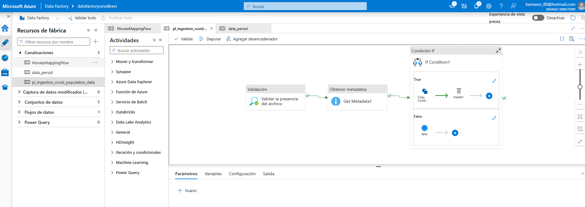
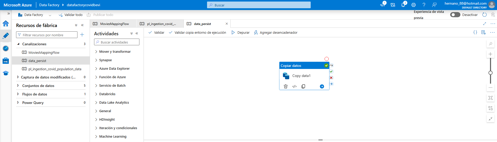
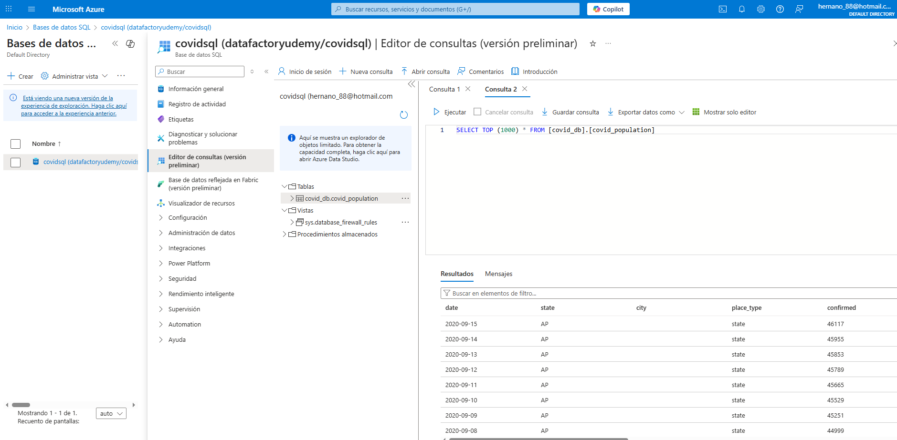

# Proyecto 1. ETL en Azure: Data Factory + SQL DatabasePipeline de Validación e Ingesta en Azure Data Factory  

Proyecto en **Azure Data Factory** que implementa un proceso de validación antes de la ingesta de datos, asegurando calidad y control en la carga de información desde **Azure Data Lake**.  

---

## 🎯 Objetivo  
Implementar un pipeline en Azure que:  
- Verifique la existencia de un archivo en Data Lake.  
- Obtenga metadatos del archivo (fecha de carga, tamaño, etc.).  
- Ejecute un flujo condicional:  
  - **True:** copia los datos y borra el archivo procesado.  
  - **False:** dispara un flujo de error controlado.  

---

## 🚀 Pipeline en Data Factory  
Pipeline orquestado que incluye:  
- Actividad de **Validación de archivos**.  
- Obtención de metadatos con **Get Metadata**.  
- Condición **If** para ejecutar ramas de éxito o error.  
- Actividad **Copy Data** para procesar el archivo cuando la validación es correcta.  

📸 Ejemplo del pipeline en Data Factory:  
  

---

## 🛢️ Manejo de datos  
El pipeline gestiona los archivos en el **Azure Data Lake Storage** y asegura que solo los archivos válidos sean procesados, evitando duplicados o errores de carga.  

---

## 📊 Resultados esperados  
- Ejecución controlada del flujo de ingesta.  
- Copia de archivos válida cuando se cumplen las condiciones.  
- Manejo automático de errores en caso de ausencia o problemas en los archivos.  

---

## 🔧 Tecnologías utilizadas  
- **Azure Data Factory**  
- **Azure Data Lake Storage**

# Proyecto 3. ETL en Azure: Data Factory + SQL Database

Proyecto de pipeline en **Azure Data Factory** para ingerir datos de COVID desde Data Lake y 
persistirlos en **Azure SQL Database**.  

---

## 🎯 Objetivo
Implementar un pipeline en Azure que:
- Ingesta datos desde archivos CSV.
- Valida la presencia de los archivos en Data Lake.
- Copia y persiste los datos en una tabla de Azure SQL Database (`covid_population`).

---

## 🚀 Pipeline en Data Factory
Pipeline orquestado que incluye:
- Validación de archivos.
- Obtención de metadatos.
- Actividad **Copy Data** para cargar información en SQL.

📸 Ejemplo de actividad *Copy Data* en el pipeline:

---

## 🛢️ Persistencia en SQL Database
Los datos se almacenan en una tabla relacional dentro de **Azure SQL Database**, accesible vía editor de consultas.  

📸 Vista de la tabla con los datos cargados:

---

## 📊 Resultados esperados
- Carga exitosa de datos en SQL Database.
- Preparación para su futura visualización en Power BI.

---

## 🔧 Tecnologías utilizadas
- **Azure Data Factory**
- **Azure Data Lake Storage**
- **Azure SQL Database**

